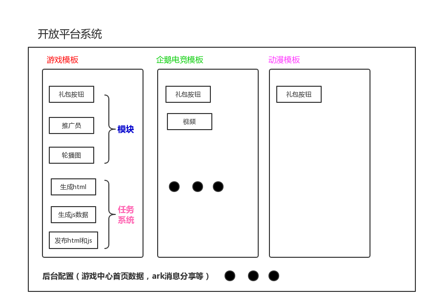
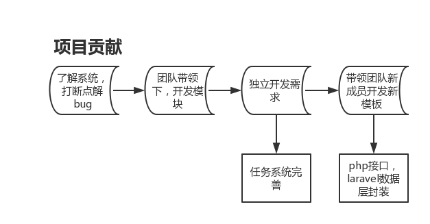
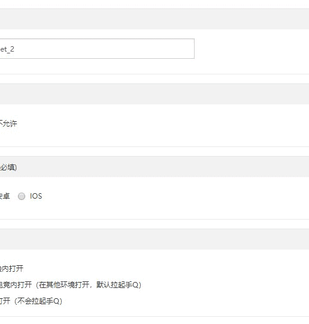

[简历地址](https://github.com/MrQingchun/lpy/blob/master/简历.md)
---
# 开放平台系统
## 系统介绍

### 前言
- 手Q上游戏、会员等业务的html5活动运营，依赖于旧版oa系统的模板工具产出，随着活动的增加，旧版oa系统的缺点暴露无疑。
- 为增加模板工具的正确性、易用性、可扩展性，基于旧版oa系统的实现，新的模板工具应运而生——**开放平台系统**。
- 新的模板工具是一站式的，将页面配置与后台工作都在模板里面处理了。新模板工具已经是一个可视化的配置工具，可以产出h5页面（自定义模板和固定模板），也可以产出后台配置（游戏中心-feeds流，游戏中心-活动中心，游戏中心-新服专区）。
### 成绩
1. 据统计，开放平台系统正式上线后的第一个月，活动总数428个，开放平台系统390个，旧版oa系统38个，活动覆盖率达到了91%；平均发布次数降低了66%，减少了出错；
2. 随着开放平台系统功能的进一步丰富，覆盖率还在继续增长，对旧版oa系统的依赖大幅降低，说明在易用性上确实提高了不少；
3. 从运营同学的反馈来看，很多之前在旧版oa系统配置的活动需要两天才能配置完的在新平台上只需要半天就行，这极大的提升了运营效率，解放了生产力；
4. 随着开放平台系统的模板支持的特性越来越多，企鹅电竞、动漫等越来越多业务接入开放平台，系统影响力提升。

## 项目贡献

- 起初，加入项目，对系统流程不熟悉，不了解组件之间的通信，从最初的打断点，解决小bug入手；
- 熟悉系统一周，输出几份文档后，在团队成员的带领下，开始开发模块，学会把可复用的模块抽出为单独的组件，弄清楚数据从哪里来，最终流向哪里；
- 然后，开始独立接需求，按照约定俗成的开发规范，开发高质量的模块，弄明白一个活动模板，由哪几部分组成，生成html时候需要调用哪些任务；
- 最后，因为模板产出活动效率高，开始带领新加入项目的同学，合作开发新的活动模板；
- 模板越来越复杂，逻辑复杂度也呈指数级增长，为复用模板公共的逻辑，完善出了任务系统。每个逻辑单独一个组件，组件内部自己组装参数，调用接口返回。任务系统管理和注册任务，用到了tj大神的co模块，基于ES6 generator的异步解决方案，能把异步的代码流程用同步的方式写出来。

- 偶尔，在后台开发人力不足的情况下，支持后台php接口或者底层能力的封装。

## 项目成长
1. 使用整套完整的前端技术选型开发（vue组件化开发 + es6新特性 + seajs模块化开发 + gulp打包构建编译 + PHP框架Laravel + git版本控制）
2. vue组件化开发
>系统采用当前出众的**vue**框架，把业务尽可能拆分成可复用的组件，目前组件已达到上百个，其中高度复用的当属**panel组件**。 
因为系统主要功能是生成html文件，难免需要填写大量数据，使用到各种表单，针对每种表单就开发个组件不仅工作量大，而且逻辑不能复用，所以开发了panel这个组件； 
表单的各个控件，如文本框、下拉框、图片上传等独立成一个个组件，panel组件中引入这些组件，并把它们拼装成一个表单； 
外部调用panel这个组件，只需传入一个表单对象，指定组件类型和数据变化的回调函数，利用**vue的render API** 通过外部配置来实现组件的自定义呈现，利用**vue的双向绑定**带来的好处获取和设置数据; 
还支持表单验证哦！

3. gulp打包构建
> 因为系统用到的组件较多，一个个加载组件耗时，使用gulp把系统常用的组件打包为一个文件，减少http请求，提升页面加载性能;  构建编译，编译es6语法，支持多浏览器
4. 在腾讯大平台磨炼，除了技术的增长，还熟悉了流程规范，懂得如何高效沟通，做一名靠谱的开发。

---
## 活动入口
>  最终开放平台产出的html页面，经推送后，会在QQ多个入口出现。

入口一 | 入口二 | 入口三|
---|---|---
QQ手游公众号|游戏中心首页|游戏中心活动页
 |  |

---
## 配置活动流程：
1. 新建项目；
2. 填写项目信息、活动负责人，保存；
2. 添加抽奖、轮播图、视频等模块，并配置数据，配置活动GIF演示如下

3. 保存项目，模块数据校验通过后，生成html文件和数据；
4. 发布测试环境，使用小工具测试礼包到账；

5. 发布现网；
6. 手机验证活动GIF演示如下：

---
## 活动配置流程图

