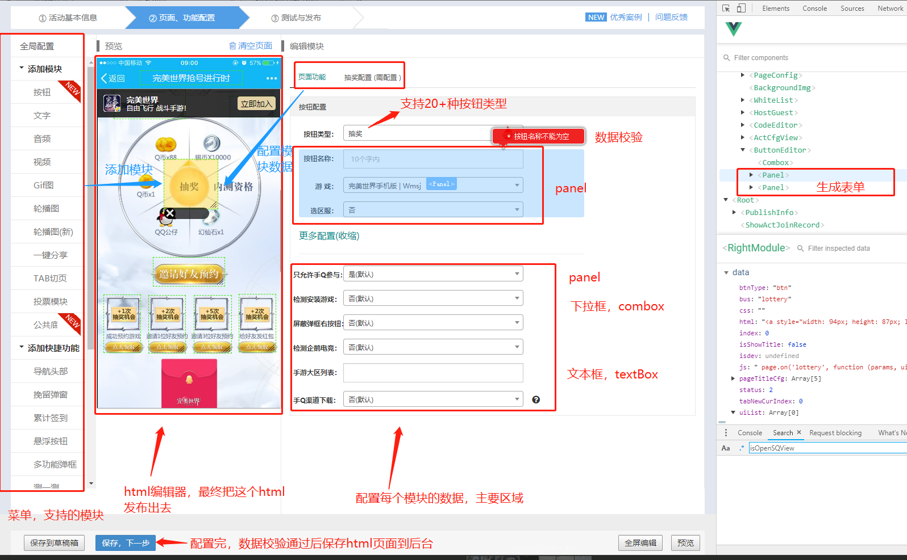
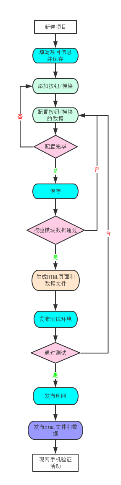

# 开放平台系统
## 系统介绍
### 前言
2017年游戏运营的方式由内部分制作变更为外部人员制作，这对ams模板的易用性，正确性提出了很大的挑战。最后我们决定基于ams服务开发一个新的模板工具。新的模板工具将重点解决：易用性、扩展性、还保证正确性。
### 职责
手Q游戏等业务活动运营页面的产出
新的模板工具是一站式的，将页面配置与后台要做什么事情都在模板里面处理了。新模板已经是一个可视化的配置工具，可以产出h5页面（自定义模板和固定模板），也可以产出后台配置（游戏中心-feeds流，游戏中心-活动中心，游戏中心-新服专区）。
### 成果
　　从十月1号开始到今天（2017年11月6号），活动总数428个，新平台390个，ams38个，活动覆盖率达到了91%。平均发布次数降低了66%，以下是具体的数据：
　　我们发现新平台上线半年来，活动覆盖率一直在稳步增长，随着我们功能的进一步丰富覆盖率一定会继续增长。同时平均发布次数相对于ams平台有大幅度降低，说明在易用性上确实提高了不少。这里的平均编辑时长由于我们是一分钟统计一次，新平台是单页应用，统计时间较准，但是ams因为涉及到多个页面，很多操作都可以不到一分钟内完成，这样的话就来不及统计，所以数据上有很大的不精确性，但是从运营同学的反馈来看，很多之前在ams配置的活动需要两天才能配置完的在新平台上只需要半天就行，这极大的提升了运营效率，解放了生产力。后续我们还会继续丰富系统能力，增强稳定性，易用性，为大家提供更好的服务支持。

// todo 差个表格
header 1 | header 2
---|---
row 1 col 1 | row 1 col 2
row 2 col 1 | row 2 col 2

## 项目参与

## 项目所学

---
## 入口
入口一 | 入口二 | 入口三|
---|---|---
QQ手游公众号|游戏中心首页|游戏中心活动页
 |  |

---
## 开放平台描述
### 技能选型
vue组件化开发，seajs模块化开发，gulp打包构建，git版本控制

#### vue组件化开发
系统采用当前出众的vue框架，把业务尽可能拆分成可复用的组件，目前组件已达到上百个，其中高度复用的当属panel组件。因为系统主要功能是生成html文件，难免需要填写大量数据，使用到各种表单，针对每种表单就开发个组件不仅工作量大，而且逻辑不能复用，所以开发了panel这个组件；表单的各个控件，如文本框、下拉框、图片上传等独立成一个个组件，panel组件中引入这些组件，并把它们拼装成一个表单；外部调用panel这个组件，只需传入一个表单对象，指定组件类型和数据变化的回调函数，利用vue的render API 通过外部配置来实现组件的自定义呈现，利用vue的双向绑定带来的好处获取和设置数据，还支持表单验证哦！

#### gulp打包构建
因为系统用到的组件较多，一个个加载组件耗时，使用gulp把系统常用的组件打包为一个文件，减少http请求，提升页面加载性能

#### 任务系统：
> 开放平台的关键操作（比如：保存草稿箱，保存下一步，发布测试环境，发布正式环境等）因为涉及到大量的业务代码执行，起初，这里业务逻辑可能比较简单，我们直接使用一个函数就可以解决，但是随着业务越来越复杂，我们发现一个函数里做的事情实在太多，同时某些业务代码可能需要用在多个地方，或者需要执行多次，为了代码的可维护性，可扩展性，任务系统应运而生

子任务必定有getDesc（任务描述），buildParam（组装参数），run（任务执行，必须返回promise对象）三个函数，我们每新增一个子任务就可以在task目录下新增一个js文件
子任务组件自己的buldParam方法获取到自己需要的参数，然后传给自己的run方法进行调用
TaskManager是任务管理器，用来管理和注册任务，最后run方法执行任务，通过遍历taskList数组依次执行每一个任务，在执行任务之前会先执行onbeginProgress方法，任务结束后会执行onendProgress方法，这里大家肯定好奇明明我们的任务是异步的，为什么还可以在任务执行完成后执行onendProgress方法，这里主要归结于yield，程序遇到yield会先执行后面的表达式，等到后面的表达式执行完成并返回值之后才会继续执行。所以我们的任务虽然是顺序执行的，但是同时又是异步的。

---
## 配置活动流程：
1. 新建项目；
2. 填写项目信息、活动负责人，保存；
2. 添加抽奖、轮播图、视频等模块，并配置数据；
3. 保存项目，模块数据校验通过后，生成html文件和数据；
4. 发布测试环境，使用小工具测试礼包到账；
5. 发布现网；
6. 手机验证活动。

### 配置活动GIF演示

1916*944

### 现网活动GIF演示

### 活动配置流程图

