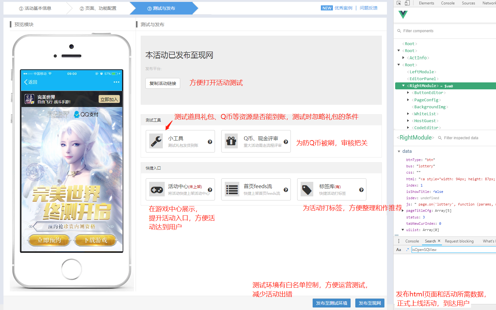

# 入口
入口一 | 入口二 | 入口三|
---|---|---
QQ手游公众号|游戏中心首页|游戏中心活动页
 |  |

## 开放平台描述
技能选型：vue组件化开发，seajs模块化开发，gulp打包构建，git版本控制
系统采用当前出众的vue框架，把业务尽可能拆分成可复用的组件，目前组件已达到上百个，其中高度复用的当属panel组件。因为系统主要功能是生成html文件，难免需要填写大量数据，使用到各种表单，针对每种表单就开发个组件不仅工作量大，而且逻辑不能复用，所以开发了panel这个组件；表单的各个控件，如文本框、下拉框、图片上传等独立成一个个组件，panel组件中引入这些组件，并把它们拼装成一个表单；外部调用panel这个组件，只需传入一个表单对象，指定组件类型和数据变化的回调函数，还支持表单验证哦！

## 配置活动流程：
1. 填写项目信息，活动负责人
2. 添加抽奖、轮播图、视频等模块，并配置数据
3. 保存，生成html文件和数据
4. 发布测试环境，使用小工具测试礼包到账
5. 发布现网
6. 手机验证活动 

## 配置活动GIF演示

## 现网活动GIF演示
